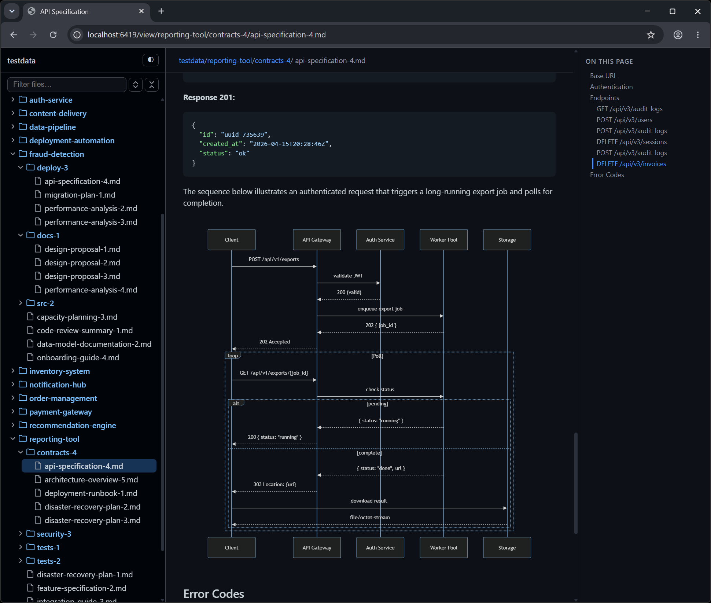

# gfm-hotview

A lightweight, yet feature-rich offline GitHub-Flavored Markdown (GFM) 
file browser and viewer.



## Features

- Supports all Gtihub markdown features: 
  - Tables, task lists, footnotes, strikethrough, autolinks
  - GitHub-style alerts (`> [!NOTE]`, `[!TIP]`, `[!IMPORTANT]`, `[!WARNING]`, `[!CAUTION]`)
  - Heading anchors, emoji shortcodes (`:rocket:`)
  - Code blocks with syntax highlighting
  - Math (`$…$`, `$$…$$`) and Mermaid blocks
- Markdown file explorer with search
- Light and dark modes
- Live reload
- Automatic port selection
- Dependency-free and easy to deploy

## Install / Build

Requires Go 1.22+.

```sh
go build -o gfm-hotview .
```

Cross-compile (fully static, `CGO_ENABLED=0`):

```sh
CGO_ENABLED=0 GOOS=windows GOARCH=amd64 go build -o gfm-hotview.exe .
CGO_ENABLED=0 GOOS=darwin  GOARCH=arm64 go build -o gfm-hotview-macos .
```

## Usage

```sh
gfm-hotview [options] [path]
```

`path` defaults to the current directory. If you pass a file, its directory
becomes the root and the file opens first.

### Options

| Flag | Default | Description |
| --- | --- | --- |
| `-p, --port` | `6419` | Port to bind (auto-selects next free if taken; `0` = OS-chosen) |
| `-H, --host` | `localhost` | Host/interface to bind |
| `--no-open` | off | Do not auto-open the browser |
| `--no-reload` | off | Disable live reload |
| `-t, --theme` | `auto` | `auto` \| `light` \| `dark` |
| `--mode` | `gfm` | `gfm` \| `markdown` (plain CommonMark) |
| `--show` | `*.md,*.markdown` | Comma-separated globs shown in the tree |
| `--hidden` | off | Include dotfiles/dot-directories |
| `--ignore` | — | Additional comma-separated ignore globs |
| `--open-page` | README-detect | Initial document (relative to root) |
| `-c, --config` | auto | Path to config file (default `.gfm-hotview/config.*`) |
| `--no-config` | off | Ignore config file and `.gfm-hotview` overrides |
| `-q, --quiet` | off | Suppress non-error logs |
| `-v, --verbose` | off | Verbose logging |
| `--version` | | Print version |

## Configuration & theming (`.gfm-hotview`)

Create an optional `.gfm-hotview` directory at the root you serve:

```
<root>/.gfm-hotview/
  config.toml      # optional: override host/port (and future settings)
  css/             # optional: CSS overrides applied after built-in styles
    theme.css
```

`config.toml` (TOML primary; YAML/JSON also accepted):

```toml
[server]
host = "127.0.0.1"
port = 8080
```

Precedence: built-in defaults → config file → command-line flags. Any CSS files
in `.gfm-hotview/css` are concatenated and served at `/user.css`, linked after the
built-in stylesheets so they win by cascade. Both are ignored with
`--no-config`. The `.gfm-hotview` directory is never shown in the tree or served
as raw content.

## Development

```sh
go test ./...      # unit tests
go vet ./...
gofmt -l .
```
