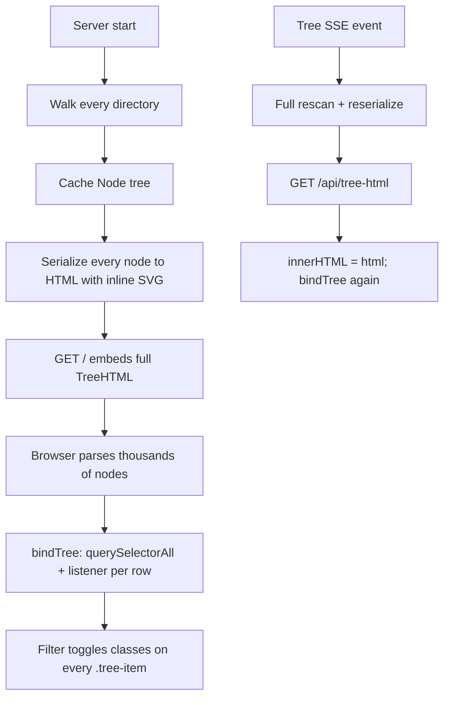
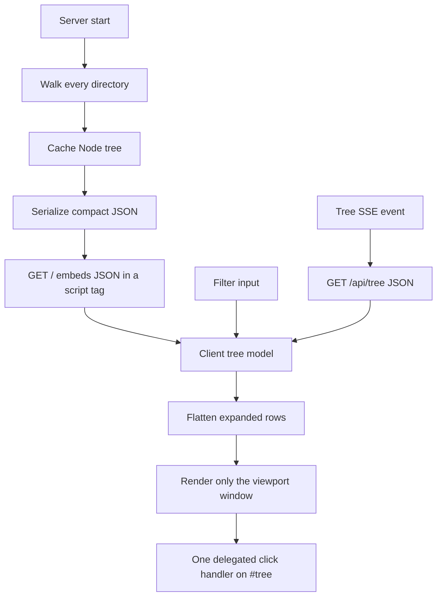

# Design: Large tree performance

| Created | Updated |
| --- | --- |
| 2026-09-08 | 2026-09-08 |

## Approach

Keep the server-side full-tree scan (it is already cheap). Stop treating the
DOM as the tree. Ship a compact JSON model, render only the visible rows of a
flattened list, and handle input with one delegated listener.

## Analysis

Opening a directory with thousands of Markdown files is slow even though the
viewer only renders one document. The cost is the sidebar, which currently
serializes **every** matching file into HTML and mounts that HTML on every
page.

### What was measured

A scratch harness against `tree.Build` and the same HTML serializer the server
uses (`writeTreeNode`, including per-row SVG icons):

| Fixture | Scan | Files | Tree HTML |
| --- | --- | --- | --- |
| 5,000 Markdown files in one directory | 12 ms | 5,000 | 2.3 MiB |
| 50 directories × 100 files | 13 ms | 5,000 | 2.4 MiB |
| 200 directories, 20 Markdown files | 2 ms | 20 | 21 KiB |

The filesystem walk is not the problem at this scale. The page payload and the
browser work that follows it are.

### Current path

The important properties of this path:

- Nested directories are `collapsed` in CSS (`display: none`) but their
  children are still in the HTML. A 50×100 tree still ships 5,000 file rows on
  first paint.
- The served root is expanded, so a flat directory of 5,000 files puts all
  5,000 rows in the layout tree.
- Each file row inlines a ~320-byte SVG. Icons dominate the 2.3 MiB figure.
- `bindTree` attaches a click listener to every folder label and every file
  link. A tree change throws the HTML away and does it again.
- Filter walks every `.tree-item`, then for each directory runs
  `querySelector` over descendants. That is superlinear in nested trees.
- `.tree-label` uses `width: max-content` with `white-space: nowrap`, so the
  browser computes the longest filename against thousands of nodes.

A compact JSON encoding of the same 5,000-file tree is on the order of a few
hundred KiB (name, path, children) rather than 2+ MiB of HTML.

### Why not speed up the walker instead

`os.ReadDir` plus `Info()` on every entry could be tightened (use `Type()` and
only `Stat` symlinks). That is worth doing as a small cleanup, but it cannot
fix a 2.3 MiB sidebar. Watcher `addRecursive` is a second walk at startup; for
a flat directory it is one watch and is similarly cheap. A huge mixed
repository with tens of thousands of directories can still stress inotify
limits; that is a separate follow-up, not the “many markdown files in one
tree” failure.

### Proposed path

Row height is already uniform (one line, fixed padding, 16 px icon). That is
enough for a vanilla virtual list: spacer above and below, render ~30–50 rows
from `scrollTop / rowHeight`. Indent is a `padding-left` from depth, matching
today’s 14 px nested-list indent, instead of nested `<ul>` elements.

One code path covers small and large trees. Expand-all updates the model so
every directory is expanded; the list is longer but still only paints the
viewport. Filter runs against the model (substring on file names, keep
ancestor directories, expand matches) and virtualizes the filtered list. The
selected file is an index in that list, not a DOM walk.

### Directory listing in the content pane

If a directory has no README/index, `dirListingHTML` currently emits a `<ul>`
of every child with the same inline SVGs. Five thousand simple links are
acceptable; five thousand inline SVGs are not. Reuse the CSS/sprite icons
there. Do not virtualize the article pane in this change.

## Decisions

- **JSON model, not HTML, is the tree source of truth.** `/api/tree` stays.
  `/api/tree-html` goes away once the client no longer uses it. The page shell
  embeds the JSON so the first paint does not wait on a second request.
- **Always virtualize the flattened visible list.** Branching on tree size
  would leave the flat-5,000 case on the slow path. Vanilla JS, no new
  client library (the project stays dependency-free aside from Mermaid/KaTeX).
- **Icons once, via CSS or a single SVG sprite**, not per row.
- **Event delegation** on `#tree`. No per-row listeners.
- **Leave the Go walk mostly as-is.** Optional `DirEntry.Type()` cleanup only.
- **Do not change filter semantics.** Same substring match on file names;
  directories without a visible file descendant stay hidden while filtering.

## Risks

- Virtualization needs a stable row height. Lock it in CSS and assert it in
  tests or a comment next to the constant.
- Screen readers only see the rows in the viewport. That is the usual file-
  tree tradeoff (VS Code does the same). Visible rows remain real links.
- Embedding JSON in HTML needs the same escaping as today (`json.Marshal` into
  a `<script type="application/json">` tag, not a JS literal).
- Expand-all on a huge nested tree makes a long flattened list. Scrolling
  stays cheap; building the flattened index must stay O(visible rows) or
  O(nodes) once per expand, not per frame.
- Tests that fetch `/api/tree-html` or assert on embedded `TreeHTML` must
  move to JSON and to “visible rows only” DOM assertions.

## Change history

| Date | Change |
| --- | --- |
| 2026-09-08 | Initial design from large-directory measurements |
