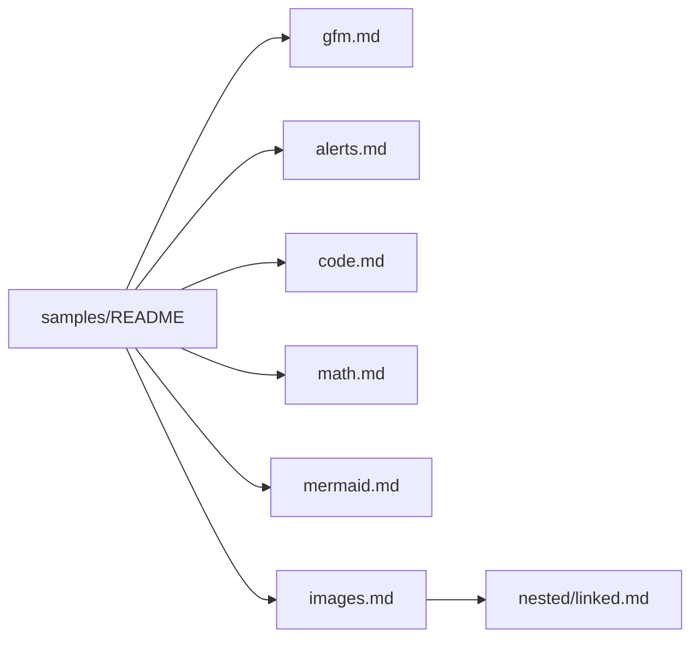
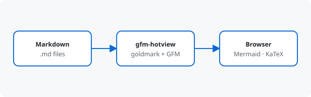

# GFM samples

A small document tree for previewing **gfm-hotview**. Open it from the repo root:

```sh
go run . samples
```


Click an image or Mermaid diagram (or its expand button) to pan and zoom.



## Pages

| Page | What it shows |
| --- | --- |
| [GFM basics](gfm.md) | Headings, emphasis, lists, tables, tasks, footnotes, emoji |
| [Alerts](alerts.md) | GitHub-style note / tip / important / warning / caution |
| [Code](code.md) | Fenced blocks with syntax highlighting and copy buttons |
| [Math](math.md) | Inline `$…$` and display `$$…$$` |
| [Mermaid](mermaid.md) | Flowchart, sequence, class, state, ER, gantt, pie |
| [Images](images.md) | SVG and raster images, plus a [nested page](nested/linked.md) |

## Architecture


