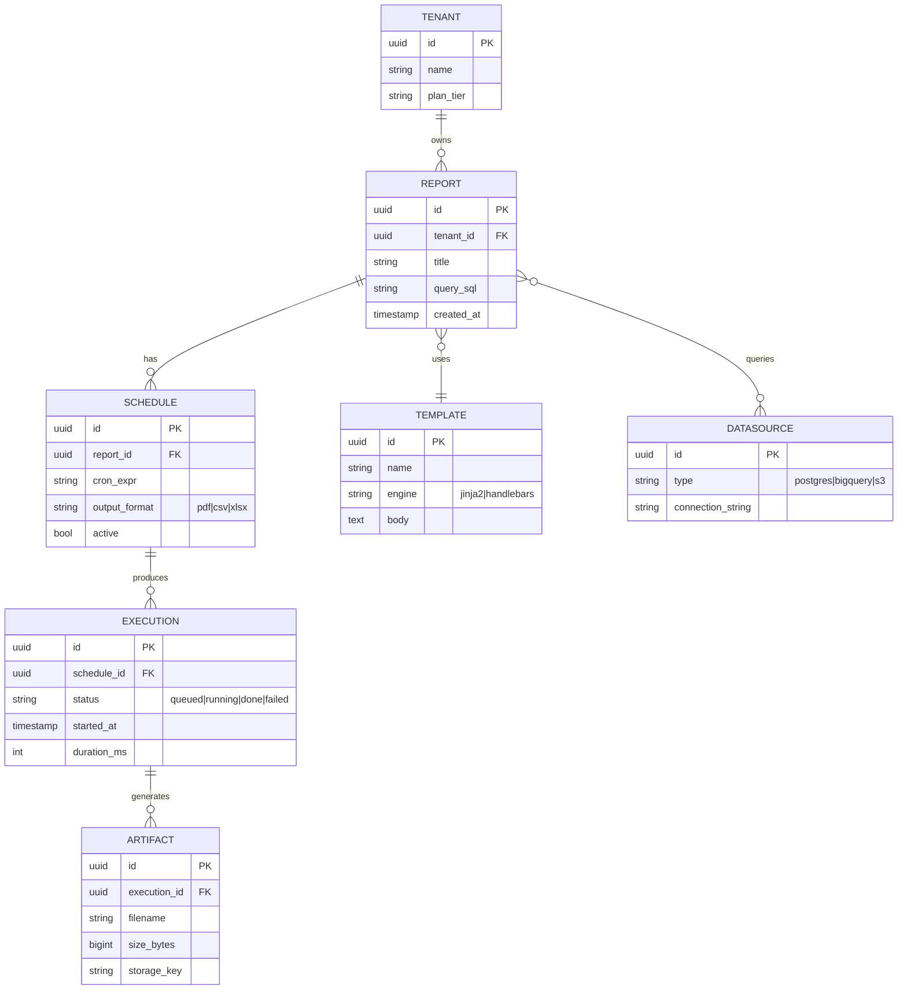

# Migration Plan

## Base URL

`https://service.internal/api/v2`

## Authentication

All endpoints require a Bearer token in the `Authorization` header.
Tokens are obtained via the OAuth2 client-credentials flow.

Lorem ipsum dolor sit amet, consectetur adipiscing elit. Sed do eiusmod tempor incididunt ut labore et dolore magna aliqua. Ut enim ad minim veniam, quis nostrud exercitation ullamco laboris nisi ut aliquip ex ea commodo consequat. Duis aute irure dolor in reprehenderit in voluptate velit esse cillum dolore eu fugiat nulla pariatur. Excepteur sint occaecat cupidatat non proident, sunt in culpa qui officia deserunt mollit anim id est laborum.

Lorem ipsum dolor sit amet, consectetur adipiscing elit. Sed do eiusmod tempor incididunt ut labore et dolore magna aliqua. Ut enim ad minim veniam, quis nostrud exercitation ullamco laboris nisi ut aliquip ex ea commodo consequat. Duis aute irure dolor in reprehenderit in voluptate velit esse cillum dolore eu fugiat nulla pariatur. Excepteur sint occaecat cupidatat non proident, sunt in culpa qui officia deserunt mollit anim id est laborum.

## Endpoints

### PUT /api/v2/users

**Description:** Lorem ipsum dolor sit amet, consectetur adipiscing elit. Sed do eiusmod tempor incididunt ut labore et dolore magna aliqua. Ut enim ad minim veniam, quis nostrud exercitation ullamco laboris nisi ut aliquip ex ea commodo consequat. Duis aute irure dolor in reprehenderit in voluptate velit esse cillum dolore eu fugiat nulla pariatur. Excepteur sint occaecat cupidatat non proident, sunt in culpa qui officia deserunt mollit anim id est laborum.


**Request:**

```json
{
  "field_one": "string",
  "field_two": 2074,
  "nested": {
    "key": "value",
    "flag": true
  }
}
```

**Response 201:**

```json
{
  "id": "uuid-471904",
  "created_at": "2026-01-24T20:06:54Z",
  "status": "ok"
}
```

### POST /api/v2/invoices

**Description:** Lorem ipsum dolor sit amet, consectetur adipiscing elit. Sed do eiusmod tempor incididunt ut labore et dolore magna aliqua. Ut enim ad minim veniam, quis nostrud exercitation ullamco laboris nisi ut aliquip ex ea commodo consequat. Duis aute irure dolor in reprehenderit in voluptate velit esse cillum dolore eu fugiat nulla pariatur. Excepteur sint occaecat cupidatat non proident, sunt in culpa qui officia deserunt mollit anim id est laborum.


**Request:**

```json
{
  "field_one": "string",
  "field_two": 5683,
  "nested": {
    "key": "value",
    "flag": true
  }
}
```

**Response 200:**

```json
{
  "id": "uuid-732289",
  "created_at": "2026-03-07T05:18:51Z",
  "status": "ok"
}
```

### PATCH /api/v2/invoices

**Description:** Lorem ipsum dolor sit amet, consectetur adipiscing elit. Sed do eiusmod tempor incididunt ut labore et dolore magna aliqua. Ut enim ad minim veniam, quis nostrud exercitation ullamco laboris nisi ut aliquip ex ea commodo consequat. Duis aute irure dolor in reprehenderit in voluptate velit esse cillum dolore eu fugiat nulla pariatur. Excepteur sint occaecat cupidatat non proident, sunt in culpa qui officia deserunt mollit anim id est laborum.


**Request:**

```json
{
  "field_one": "string",
  "field_two": 9655,
  "nested": {
    "key": "value",
    "flag": true
  }
}
```

**Response 200:**

```json
{
  "id": "uuid-337713",
  "created_at": "2026-01-25T06:26:58Z",
  "status": "ok"
}
```

The reporting data model shown below captures the relationships between
reports, schedules, and output formats.



## Error Codes

| Code | Meaning | Retryable |
|------|---------|----------|
| 400  | Validation error | No |
| 401  | Missing / expired token | No |
| 403  | Insufficient permissions | No |
| 429  | Rate limit exceeded | Yes (after retry-after) |
| 500  | Internal server error | Yes (exponential backoff) |
| 503  | Service unavailable (degraded) | Yes |

Lorem ipsum dolor sit amet, consectetur adipiscing elit. Sed do eiusmod tempor incididunt ut labore et dolore magna aliqua. Ut enim ad minim veniam, quis nostrud exercitation ullamco laboris nisi ut aliquip ex ea commodo consequat. Duis aute irure dolor in reprehenderit in voluptate velit esse cillum dolore eu fugiat nulla pariatur. Excepteur sint occaecat cupidatat non proident, sunt in culpa qui officia deserunt mollit anim id est laborum.

Lorem ipsum dolor sit amet, consectetur adipiscing elit. Sed do eiusmod tempor incididunt ut labore et dolore magna aliqua. Ut enim ad minim veniam, quis nostrud exercitation ullamco laboris nisi ut aliquip ex ea commodo consequat. Duis aute irure dolor in reprehenderit in voluptate velit esse cillum dolore eu fugiat nulla pariatur. Excepteur sint occaecat cupidatat non proident, sunt in culpa qui officia deserunt mollit anim id est laborum.

